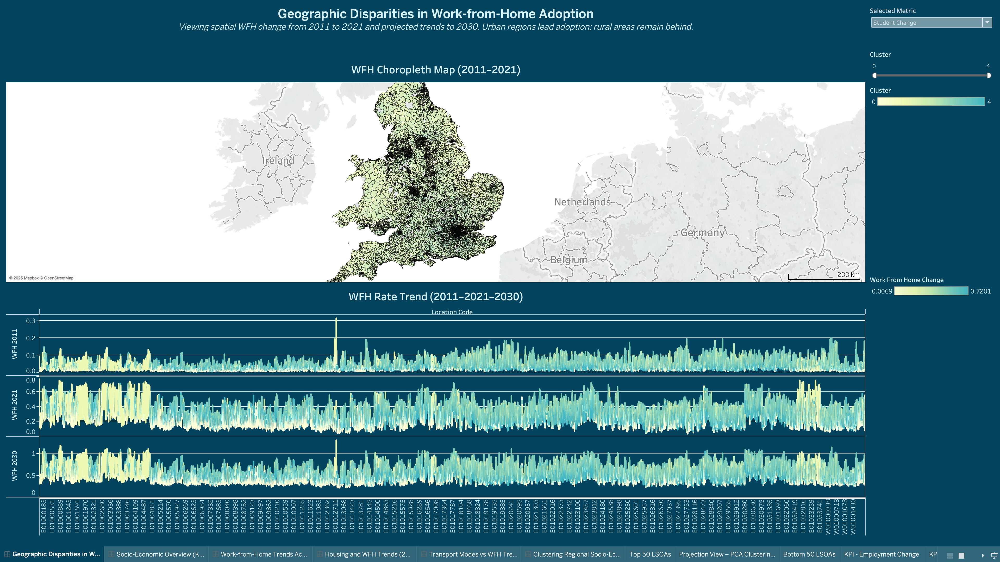
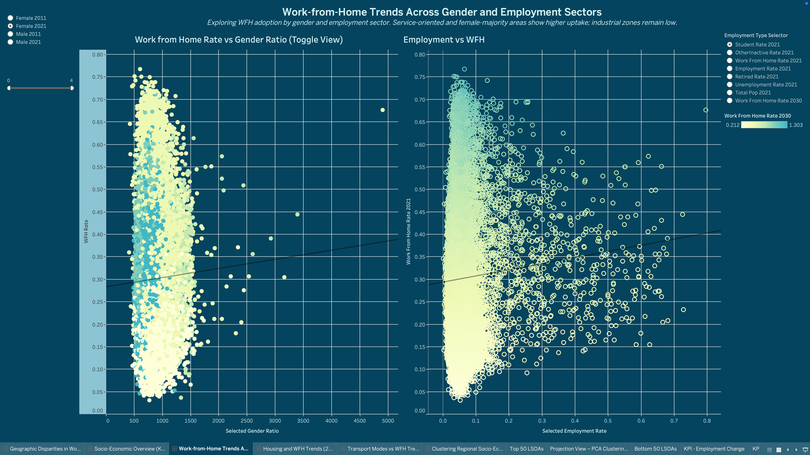
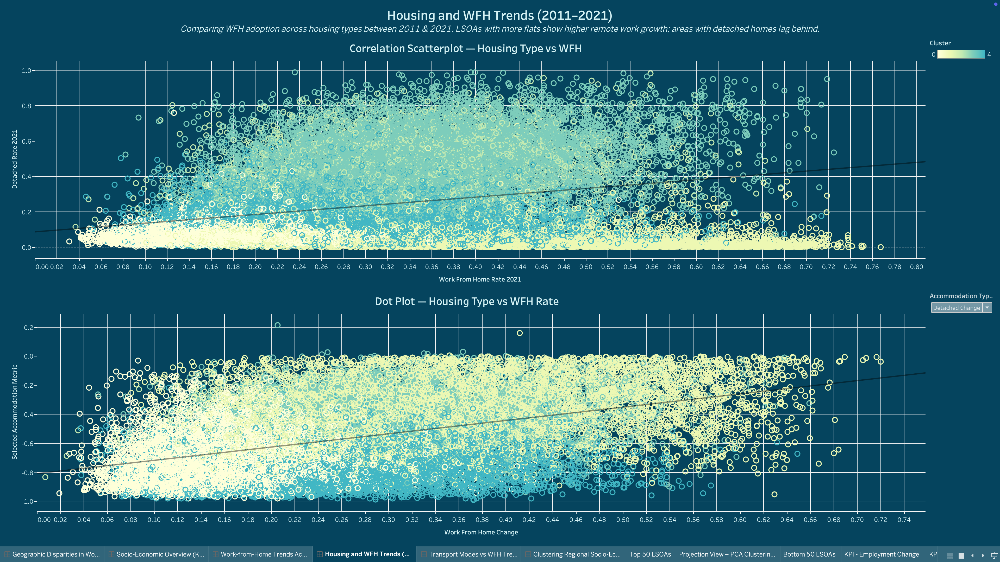
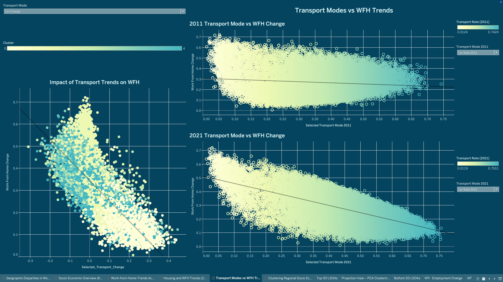
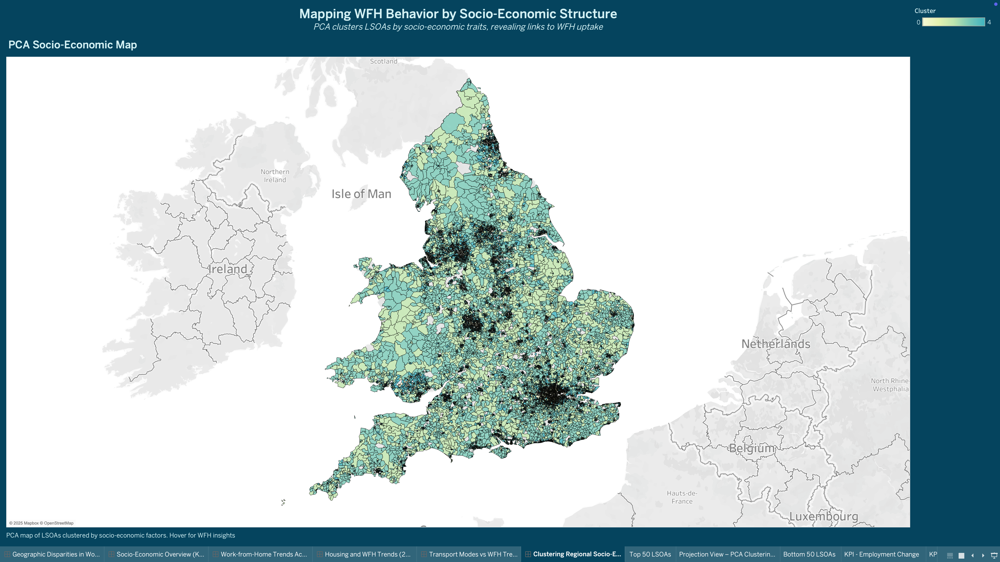

+🚀)

<p align="center">
  
  
  
  
</p>

---

## 🌍 Overview

This project analyzes how socio-economic and infrastructure variables influenced the rise of **remote working (WFH)** in England & Wales, using **Census data from 2011 and 2021**, and forecasts adoption through **2030** using machine learning.

Key deliverables:
- Interactive Tableau dashboards for policymakers
- Python-powered ML pipeline including PCA, t-SNE, Bayesian Linear Regression
- 33,000+ LSOAs analyzed across gender, employment, housing, and transport metrics

---

## ✨ Highlights

- 🔮 Predictive analytics using **Bayesian Linear Regression**  
- 📉 **PCA & t-SNE** for socioeconomic pattern discovery  
- 🗺️ Geographic mapping using Tableau choropleths  
- 📈 Time series comparison: 2011 ➡️ 2021 ➡️ 2030  
- ⚡ Dashboards powered by delta metrics (change features)  

---

## 📸 Visual Dashboard Samples

### 🗺️ Geographic Distribution of WFH
<p align="center">
  
</p>

### 🔼 Top vs Bottom Performing Regions
<p align="center">
  
</p>

### 📈 WFH Trend 2011–2021–2030
<p align="center">
  
</p>

### 🏘️ Housing Type vs WFH Growth
<p align="center">
  
</p>

### 🚇 Transport Access and WFH Rate
<p align="center">
  
</p>

### 🧬 PCA View of LSOAs
<p align="center">
  
</p>

---

## 🛠 Data Pipeline

## 🛠 Data Pipeline

```mermaid
flowchart TD
    A[Census Data 2011/2021] --> B[Data Cleaning (pandas)]
    B --> C[Feature Engineering]
    C --> D[Delta Metrics (2011–2021)]
    D --> E[PCA & t-SNE (scikit-learn)]
    C --> F[Bayesian Regression (PyMC3)]
    E --> G[Tableau Dashboards]
    F --> G

## 🔍 Key Insights

📈 **Higher WFH growth** in regions with:

- More flats and converted commercial housing  
- High full-time employment & digital infrastructure  
- Better access to cycling/public transport  

🚧 **Lower WFH adoption** in areas with:

- High student populations  
- Poor metro/transport connectivity  

📅 **2030 WFH Forecast**:

- Ongoing growth expected  
- Regional inequality persists unless infrastructure is addressed  

---

## 👥 Target Stakeholders

- 🏛️ **Policy Makers** – Plan digital infrastructure investments  
- 🏘️ **Urban Planners** – Design remote-friendly housing & cities  
- 🧑‍💼 **HR Professionals** – Tailor hybrid work policies to region-specific needs  
- 📚 **Academics/Researchers** – Study spatial digital inequality  

---

## 🚀 Quick Start

### 1. Clone this repo

```bash
git clone https://github.com/yourusername/WFH-VisualAnalytics-UK-2011-2030.git
cd WFH-VisualAnalytics-UK-2011-2030
```
